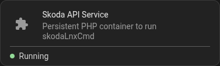

# HomeAssistant

Work in progress!!!!!!!!!!!!!!

## HA OS install



* Install `Advanced SSH & Web Terminal`
* Disable `Protection mode`
* Set a password
* Start Addon

* `mkdir /addons/skodalnxcmd`
* `cd /addons/skodalnxcmd`

Create `config.yaml`
```yaml
name: "Skoda API Service"
version: "1.0.0"
slug: "skodalnxcmd_service"
description: "Persistent PHP container to run skodaLnxCmd"
arch:
  - aarch64
  - amd64
  - armv7
startup: "once"
options:
  SKODA_VIN: "TMBNG123456789012"
  SKODA_KEY: "msk_xxxxxxxxxxxx"
  SKODA_PIN: "1234"
schema:
  SKODA_VIN: string
  SKODA_KEY: string
  SKODA_PIN: string

# Translate env var to what is used by script
environment:
  SKODA_VIN: "SKODA_VIN"
  SKODA_KEY: "SKODA_KEY"
  SKODA_PIN: "SKODA_PIN"
```
Create `Dockerfile`
```dockerfile
FROM alpine:latest

RUN apk --no-cache upgrade
RUN apk add --no-cache \
    php-cli \
    php-curl \
    php-json \
    php-mbstring \
    php-posix
COPY skodaCmdLnx.php /usr/local/bin/
RUN chmod a+x /usr/local/bin/*.php
CMD ["sleep", "infinity"]
```

* Restart HA

Go into setting->settings->apps and install the new "app".
Start the app

Go to terminal, run 'docker ps'

Find the name for the running container (example: `app_local_skodalnxcmd_service`)


Work in progress!!!!!!!!!!!!!!

## Requirements

You need to install:

* php-cli
* php-curl
* php-json
* php-posix
* php-mbstring

```shell
# Alpine Linux
apk add php-cli php-curl php-json php-posix php-mbstring
```

```shell
# Debian based
apt install -y php-cli php-curl php-json php-posix php-mbstring
```

## Setup

> [NOTE]
> Since the script caches the JSON file, we can implement the fetch as different sensors, without the cache the
> API would have been hit once per sensor. A 5-minute refresh uses 12 of the 20 API calls per hour.

```yaml
# secrets.yaml
# EV example
skoda_base_cmd: >
  docker exec -i addon_skodalnxcmd_service php /config/scripts/skodaLnxCmd.php json
skoda_ac_cmd: >
  docker exec -i addon_skodalnxcmd_service php /config/scripts/skodaLnxCmd.php ac
skoda_ac_off_cmd: >
  docker exec -i addon_skodalnxcmd_service php /config/scripts/skodaLnxCmd.php reset
```

If you have an ICE vehicle, change `skodaLnxCmd.php ac` to `skodaLnxCmd.php heat` and add you PIN as env-var `SKODA_PIN`.
The `skodaLnxCmd.php reset` will turn off AC, auxiliary heater and ventilation. HEVs and PHEVs may support both AC and heat.

```yaml
# configuration.yaml
# EV configuration
shell_command:
  skoda_ac_on: !secret skoda_ac_cmd
  skoda_ac_off: !secret skoda_ac_off_cmd
command_line:
  - sensor:
      name: "Skoda State of Charge"
      command: !secret skoda_base_cmd
      scan_interval: 600
      value_template: "{{ value_json.soc }}"
      unit_of_measurement: "%"
      icon: "mdi:car-electric"

  - sensor:
      name: "Skoda Lock Status"
      command: !secret skoda_base_cmd
      scan_interval: 600
      value_template: "{{ value_json.locked }}"
      icon: "mdi:car-door-lock"

  - sensor:
      name: "Skoda Odometer"
      command: !secret skoda_base_cmd
      scan_interval: 600
      value_template: "{{ value_json.odometer }}"
      unit_of_measurement: "km"
      icon: "mdi:counter"

  - sensor:
      name: "Skoda Range"
      command: !secret skoda_base_cmd
      scan_interval: 600
      value_template: "{{ value_json.range }}"
      unit_of_measurement: "km"
      icon: "mdi:gauge"

  - sensor:
      name: "Skoda Parking Location"
      command: !secret skoda_base_cmd
      scan_interval: 600
      value_template: "{{ value_json.parking_location }}"
      icon: "mdi:map-marker"

  - sensor:
      name: "Skoda Charge Completion"
      command: !secret skoda_base_cmd
      scan_interval: 600
      value_template: "{{ value_json.charge_done }}"
      device_class: timestamp
      icon: "mdi:clock-check-outline"

  - sensor:
      name: "Skoda Charging Power"
      command: !secret skoda_base_cmd
      scan_interval: 600
      value_template: "{{ value_json.charge_power | float(0) }}"
      unit_of_measurement: "kW"
      device_class: power
      state_class: measurement
      icon: "mdi:lightning-bolt"

  - sensor:
      name: "Skoda Charging Rate"
      command: !secret skoda_base_cmd
      scan_interval: 600
      value_template: "{{ value_json.charge_rate | float(0) }}"
      unit_of_measurement: "km/h"
      state_class: measurement
      icon: "mdi:speedometer"
```

Note: This document has been created with the assistance of Googles AI.
